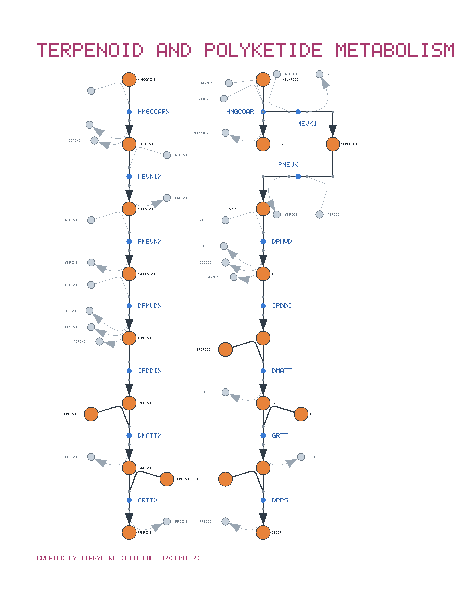
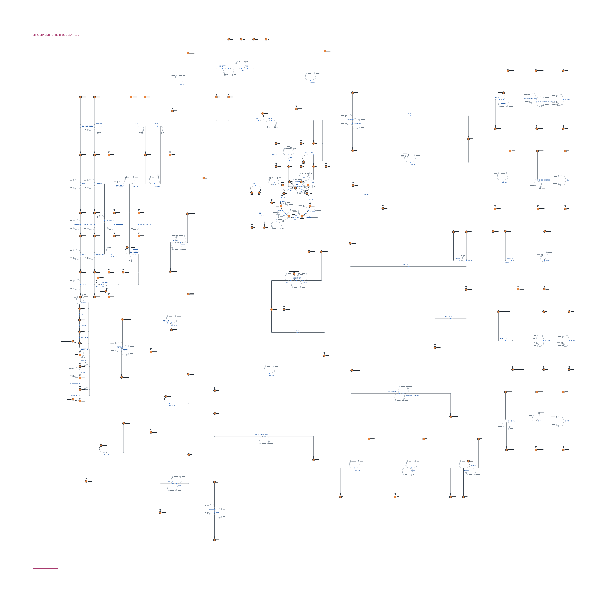
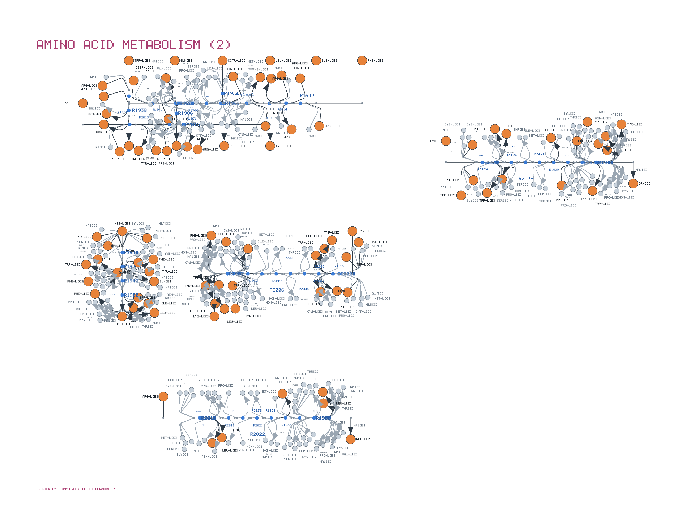
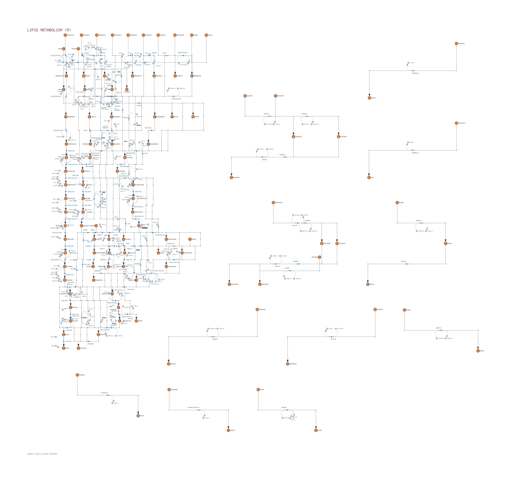

# Escher Maps for BiGG Models

Automatically generated, Escher-compatible metabolic maps for the models in the
[BiGG Models database](http://bigg.ucsd.edu/) — **2,623 maps across all 108 models**, one per
functional pathway group.

Every map in this repository was produced by **MetaCarto**, a layout engine that draws a
metabolic network the way a curator would rather than the way a force-directed algorithm does.
**MetaCarto will be released soon**; this repository is its output, published ahead of the code.

---

## What the maps look like

Four maps from **Recon3D**, the largest human reconstruction in the collection (10,600
reactions, 93 maps). Click any image for full resolution.

### Terpenoid and polyketide metabolism

[](previews/Recon3D_Terpenoid_and_polyketide_metabolism.png)

The mevalonate pathway, 15 reactions. The same route runs in two compartments — peroxisomal
(`[x]`, left) and cytosolic (`[c]`, right) — and each is drawn as one straight backbone from
HMG-CoA down to farnesyl and decaprenyl diphosphate. ATP, ADP, NADPH, CoA, PPi and CO₂ leave the
backbone as paired curved stubs, so the carbon route reads without the cofactors interrupting
it. [Map JSON](Recon3D/Terpenoid_and_polyketide_metabolism.json)

### Carbohydrate metabolism (1)

[](previews/Recon3D_Carbohydrate_metabolism__1_.png)

116 reactions. Glycolysis forms the long vertical spine on the left; the TCA cycle is drawn as
an actual ring in the centre, rotated so its entry arc faces the pathway feeding it. The small
pieces around them are reactions sharing no primary compound with the rest — they are packed
into the space around the pathways rather than each given a row of its own.
[Map JSON](Recon3D/Carbohydrate_metabolism__1_.json)

### Amino acid metabolism (2)

[](previews/Recon3D_Amino_acid_metabolism__2_.png)

120 reactions, 939 nodes — among the best-scoring large maps in the collection
(`hairball_index` 3.2, 0.21 crossings per edge).
[Map JSON](Recon3D/Amino_acid_metabolism__2_.json)

### Lipid metabolism (5)

[](previews/Recon3D_Lipid_metabolism__5_.png)

115 reactions, 1,137 nodes. Fatty-acid chains give long unbranched runs, which is the case a
layered drawing handles best. [Map JSON](Recon3D/Lipid_metabolism__5_.json)

These images are rendered from the map files themselves, by the same geometry Escher draws from
— they are not mock-ups. Opening any of them in the viewer gives exactly this layout.

---

## Licence and citation

These maps are licensed under
**[CC BY 4.0](https://creativecommons.org/licenses/by/4.0/)**. You are free to share and adapt
them, including commercially, **on the condition that you give attribution** — attribution is a
term of the licence, not a courtesy.

**If you use or modify these maps — in a paper, a figure, a talk, a poster, a database, or
derived software — you must cite this repository.**

```bibtex
@misc{wu_escher_maps_bigg,
  author       = {Wu, Tianyu},
  title        = {Escher Maps for BiGG Models: automatically generated metabolic
                  pathway maps},
  year         = {2026},
  howpublished = {\url{https://github.com/forxhunter/escher_maps_BiGG}},
  note         = {Generated with MetaCarto}
}
```

Plain text:

> Wu, T. *Escher Maps for BiGG Models: automatically generated metabolic pathway maps.*
> https://github.com/forxhunter/escher_maps_BiGG (generated with MetaCarto).

This applies to modified maps as well: if you edit a map in Escher and publish the result, the
layout is still derived from this work. A MetaCarto citation will be added here on release —
please use both from that point on.

Please also cite the underlying model from
[BiGG Models](http://bigg.ucsd.edu/) and, where the maps are displayed,
[Escher](https://doi.org/10.1371/journal.pcbi.1004321).

---

## Using the maps

### In the browser

**[→ Open the Escher viewer](https://forxhunter.github.io/escher/)**

- **Map ▸ Load map from library…** browses this repository directly: pick a model, then a
  pathway. Nothing to download.
- **Map ▸ Load map JSON** opens a file you have saved locally.

### In your own code

The files are plain [Escher](https://escher.github.io/) JSON and load anywhere Escher runs —
the Python package, the Jupyter widget, or an embedded `escher.Builder`.

```python
import escher, json, urllib.request

url = ('https://raw.githubusercontent.com/forxhunter/escher_maps_BiGG/main/'
       'e_coli_core/Carbohydrate_metabolism.json')
with urllib.request.urlopen(url) as response:
    map_json = json.load(response)

escher.Builder(map_json=json.dumps(map_json)).display_in_notebook()
```

---

## Repository structure

```
map_index.json                     every model, with map counts
{Model_ID}/
    model_index.json               every map in this model, with sizes
    {Pathway_group}.json           one functional pathway group
```

Maps are named for the metabolic function they cover — `Carbohydrate_metabolism`,
`Amino_acid_metabolism`, `Lipid_metabolism`, `Nucleotide_metabolism`,
`Energy_metabolism`, `Transport_and_exchange` and so on, following the
[KEGG BRITE](https://www.genome.jp/kegg/brite.html) top-level categories. A group too large to
draw on one page is split and numbered (`Carbohydrate_metabolism__1_`,
`Carbohydrate_metabolism__2_`); the split is made along the network, so each part is still a
connected piece of chemistry rather than an arbitrary slice.

Reactions are assigned to a group from the model's own `subsystem` annotation where it has one,
then from a KEGG pathway lookup, and only failing both from network structure. Earlier releases
of this collection published thousands of tiny `Cluster_N` maps of a handful of reactions each;
those are gone, replaced by fewer and larger maps that correspond to something a biologist would
name. The median model now has 29 maps rather than several hundred.

The index files exist so applications can list the collection without cloning it — the root
index is 13 KB. They are regenerated together with the maps.

The map JSON is minified. It is read by software, not by people, and indenting it costs 43% of
the download for nothing.

**Whole-model maps are not included in this release.** Tiling an entire genome-scale
reconstruction onto one canvas gives every reaction so little area that the labels fall below
readable size — Recon3D comes out at 0.14 pt — so the file is large without being useful. The
per-pathway maps are the readable artifact.

---

## How the maps are made

MetaCarto is constructive and deterministic — no annealing, no random seed. The same model
always produces the same map. Five ideas do most of the work:

1. **Primary-compound reduction.** A reaction such as
   `pyruvate + CoA + NAD⁺ → acetyl-CoA + CO₂ + NADH` becomes *one* directed edge, between the
   substrate/product pair that shares the most molecular skeleton — here pyruvate → acetyl-CoA.
   Everything else is drawn as a side branch. Without this reduction every reaction node has
   degree 4–8 and no clean orthogonal drawing exists, which is why naive layouts of metabolic
   networks come out as hairballs.

2. **Direction from flux.** Reconstructions store reversible reactions in whichever direction
   the curator happened to write them, so glycolysis is often recorded partly backwards. Parsimonious
   FBA decides the drawn direction wherever a reaction carries flux.

3. **Cycles drawn as cycles.** The TCA cycle, the urea cycle and the Calvin cycle are detected
   and placed on a ring, rotated so the ring's entry arc faces the pathway feeding it.

4. **Layered drawing.** A Sugiyama layering with Brandes–Köpf coordinate assignment gives the
   vertical flow and the straight pathway backbones. Edges are routed orthogonally.

5. **Two scales.** The whole-model map runs the same algorithm again one level up: each cluster
   drawing becomes a tile, tiles are ordered by metabolic flow and packed into a captioned poster.

Cofactors are drawn as curved side branches off the reaction arrow, paired on one side, the way
curated maps draw them. Labels sit beside the thing they name, shrinking to a legible minimum
rather than drifting away from it.

---

## Quality

Every map is scored on edge orthogonality, edge crossings, node separation, label collisions and
local density. Across the collection the median map is fully axis-aligned with no edge crossings
and no label overlaps.

Maps are laid out main-pathway-first: the connected pathway cores are placed and keep the shape
the layering gave them, then the small one- and two-reaction pieces are filled into the space
around them, nearest first. The alternative — giving every disconnected piece its own row — is
what makes an automatic map read as mostly white.

These are automatic layouts, and they are not uniformly perfect. Known limits:

- A few reactions per genome-scale model have no drawable primary pair — typically small
  inorganic chemistry such as catalase or CO₂ transport — and are omitted from the map.
- Very dense fans, biomass reactions above all, still produce occasional label collisions.
- The whole-model maps are dense by construction; the per-cluster maps are the ones to read.

Corrections and improved layouts are welcome — open an issue or a pull request.

---

## Licence

[Creative Commons Attribution 4.0 International](https://creativecommons.org/licenses/by/4.0/)
(CC BY 4.0) — full legal code in [LICENSE](LICENSE), summary in [NOTICE](NOTICE).

You may share and adapt these maps for any purpose, including commercially. You must give
appropriate credit, link to the licence, and indicate if you made changes. See
**Licence and citation** above for the form that credit should take.

*Created by Tianyu Wu (GitHub: [forxhunter](https://github.com/forxhunter)), University of
Illinois Urbana-Champaign.*
