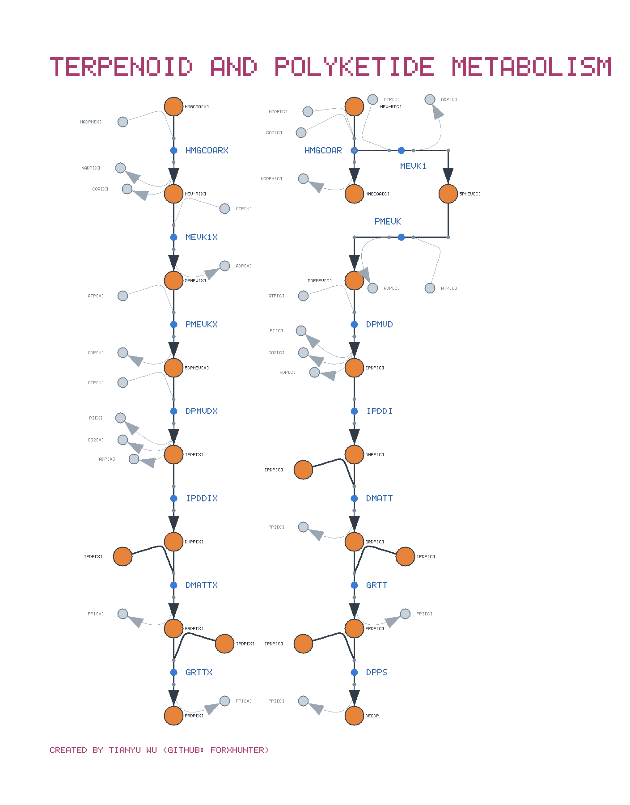
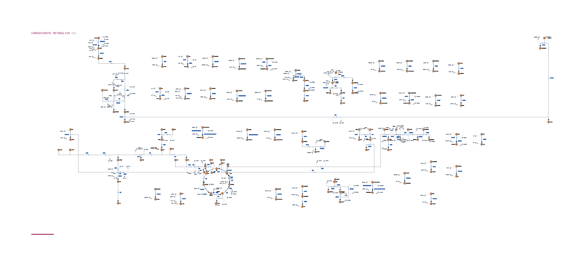
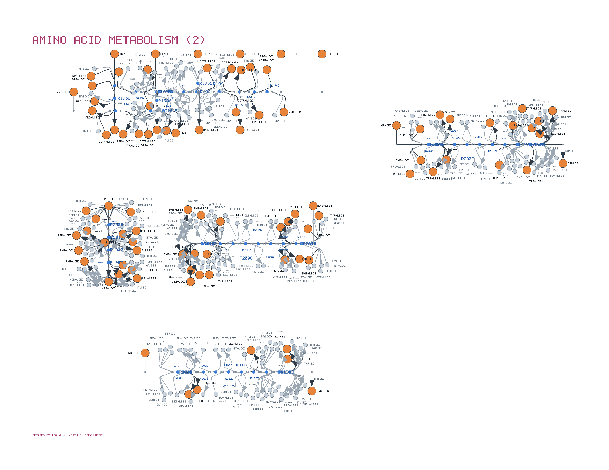
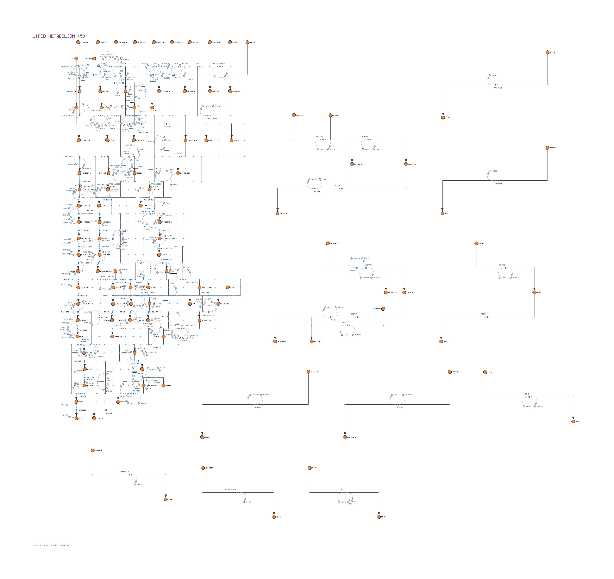

# Escher Maps for BiGG Models

Automatically generated, Escher-compatible metabolic maps for all 108 models in the
[BiGG Models database](http://bigg.ucsd.edu/): **2,763 pathway maps, plus every model drawn whole
on one canvas** — 251,405 of BiGG's 251,424 reactions, as Escher JSON and as SVG. This is v2, the
current generation, in [`v2/`](v2/), and it is what the repository's default index lists. The
previous generation, v1, is still here unchanged; see [v1](#v1-the-previous-generation) below.

Every map in this repository was produced by **MetaCarto**, a layout engine that draws a
metabolic network the way a curator would rather than the way a force-directed algorithm does.
The code is open at [forxhunter/MetaCarto](https://github.com/forxhunter/MetaCarto) (release
[v2.0.0](https://github.com/forxhunter/MetaCarto/releases/tag/v2.0.0)), and the method is described in a
[bioRxiv preprint](https://doi.org/10.64898/2026.09.19.752882).

**[→ Open the maps in the Escher viewer](https://forxhunter.github.io/escher/)** — it opens on
e_coli_core's canvas, and *Map ▸ Load map from library…* browses the whole collection.

---

## What the maps look like

Every model comes as a single canvas as well as its pathway maps. Each pathway keeps the drawing
it has on its own map; the pathways are packed by the shape their ink actually covers — related
pathways together, each KEGG superclass one captioned region. Nothing overlaps, and no text sits
on a node, an edge or other text. Both canvases below are the published SVG files; open one and
zoom in.

**e_coli_core** — 95 reactions: carbohydrate metabolism (glycolysis, the TCA cycle with
glutamate metabolism off 2-oxoglutarate, the pentose phosphate pathway, pyruvate metabolism),
oxidative phosphorylation, and transport and exchange.
[JSON](v2/e_coli_core/e_coli_core_Canvas.json)

[](v2/e_coli_core/e_coli_core_Canvas.svg)

**Recon3D** — 10,598 of the human reconstruction's 10,600 reactions on one page (19 MB; it
takes a few seconds to appear). [JSON](v2/Recon3D/Recon3D_Canvas.json)

[](v2/Recon3D/Recon3D_Canvas.svg)

A whole genome-scale reconstruction on one page is not a print figure — at page size Recon3D's
labels are well under a point — so the canvases are for zooming, in the SVG or in the viewer.
The pathway maps are the readable, printable artifact.

---

## Licence and citation

These maps are licensed under
**[CC BY 4.0](https://creativecommons.org/licenses/by/4.0/)**. You are free to share and adapt
them, including commercially, **on the condition that you give attribution** — attribution is a
term of the licence, not a courtesy.

**If you use or modify these maps — in a paper, a figure, a talk, a poster, a database, or
derived software — you must cite this repository.**

```bibtex
@misc{wu_escher_maps_bigg,
  author       = {Wu, Tianyu},
  title        = {Escher Maps for BiGG Models: automatically generated metabolic
                  pathway maps},
  year         = {2026},
  howpublished = {\url{https://github.com/forxhunter/Awesome_visualization_Metabolic_Network}},
  note         = {Generated with MetaCarto}
}
```

Plain text:

> Wu, T. *Escher Maps for BiGG Models: automatically generated metabolic pathway maps.*
> https://github.com/forxhunter/Awesome_visualization_Metabolic_Network (generated with MetaCarto).

This applies to modified maps as well: if you edit a map in Escher and publish the result, the
layout is still derived from this work.

Please cite the method that drew them alongside the collection itself:

> Wu, T. (2026). MetaCarto: biologically faithful automatic layout for genome-scale metabolic
> maps. *bioRxiv*. https://doi.org/10.64898/2026.09.19.752882

```bibtex
@article{wu_metacarto_2026,
  author  = {Wu, Tianyu},
  title   = {{MetaCarto}: biologically faithful automatic layout for genome-scale metabolic maps},
  journal = {bioRxiv},
  year    = {2026},
  doi     = {10.64898/2026.09.19.752882}
}
```

and, for MetaCarto 2 specifically, the software:

```bibtex
@software{Wu_MetaCarto_constructive_layout,
  author  = {Wu, Tianyu},
  license = {CC-BY-4.0},
  title   = {{MetaCarto: constructive layout synthesis for genome-scale metabolic networks}},
  url     = {https://github.com/forxhunter/MetaCarto}
}
```

Please also cite the underlying model from
[BiGG Models](http://bigg.ucsd.edu/) and, where the maps are displayed,
[Escher](https://doi.org/10.1371/journal.pcbi.1004321).

---

## Using the maps

### In the browser

**[→ Open the Escher viewer](https://forxhunter.github.io/escher/)**

- **Map ▸ Load map from library…** browses this repository directly: pick a model, then its
  canvas or a pathway. Nothing to download. A switch at the top of the library goes back to v1.
- **Double-click** a pathway's caption on a canvas to select the whole pathway, or a reaction to
  select the reaction; **drag a reaction** and its name and cofactors come with it (Alt moves a
  single node).
- **Map ▸ Load map JSON** opens a file you have saved locally.

### In your own code

The files are plain [Escher](https://escher.github.io/) JSON and load anywhere Escher runs —
the Python package, the Jupyter widget, or an embedded `escher.Builder`.

```python
import escher, json, urllib.request

url = ('https://raw.githubusercontent.com/forxhunter/Awesome_visualization_Metabolic_Network/main/'
       'v2/e_coli_core/Carbohydrate_metabolism.json')
with urllib.request.urlopen(url) as response:
    map_json = json.load(response)

escher.Builder(map_json=json.dumps(map_json)).display_in_notebook()
```

Each map's header also records which pathway every reaction belongs to (`pathways`), and a
canvas which caption belongs to which region (`regions`), so a program can select or colour a
pathway without parsing captions. Escher ignores both fields.

---

## Repository structure

```
map_index.json                     the default index: v2, every model with map counts
v2/
    map_index.json                 the same index, resolving relative to v2/
    {Model_ID}/
        model_index.json           every map in this model; the canvas first
        {Model_ID}_Canvas.json     the whole model on one canvas (+ .svg)
        {Pathway_group}.json       one functional pathway group (+ .svg)
map_index_v1.json                  the v1 index
{Model_ID}/                        v1 maps, where they have always been
previews/                          the v1 preview images below
```

Maps are named for the metabolic function they cover, following the
[KEGG BRITE](https://www.genome.jp/kegg/brite.html) top-level categories — `Carbohydrate
metabolism`, `Amino acid metabolism`, `Lipid metabolism`, `Energy metabolism`, `Transport and
exchange` and so on. A group too large for one page is split along the network into pages titled
for the pathways on each, so each page is still a connected piece of chemistry. Reactions are
assigned to a pathway from the model's own `subsystem` annotation where it has one, then from a
KEGG pathway lookup, and only failing both from network structure.

The index files exist so applications can list the collection without cloning it; the default
index is 34 KB. The map JSON is minified — it is read by software, not by people, and indenting
it costs 43% of the download for nothing.

---

## How the maps are made

MetaCarto is constructive and deterministic — no annealing, no random seed. The same model
always produces the same map.

1. **Primary-compound reduction.** A reaction such as
   `pyruvate + CoA + NAD⁺ → acetyl-CoA + CO₂ + NADH` becomes *one* directed edge, between the
   substrate/product pair that shares the most molecular skeleton — here pyruvate → acetyl-CoA.
   Everything else is drawn as a side branch. Without this reduction every reaction node has
   degree 4–8 and no clean orthogonal drawing exists, which is why naive layouts of metabolic
   networks come out as hairballs. Where a model gives no formulas, names stand in for them.

2. **Direction from flux.** Reconstructions store reversible reactions in whichever direction
   the curator happened to write them, so glycolysis is often recorded partly backwards.
   Parsimonious FBA decides the drawn direction wherever a reaction carries flux.

3. **Cycles drawn as cycles.** The TCA cycle, the urea cycle and the Calvin cycle are detected
   and placed on a ring, rotated so the ring's entry arc faces the pathway feeding it.

4. **Layered drawing.** A Sugiyama layering with Brandes–Köpf coordinate assignment gives the
   vertical flow and the straight pathway backbones. Edges are routed orthogonally.

5. **Nothing drawn on anything else.** Text never touches a node, an edge or other text.
   Reactions joining the same two metabolites get lanes of their own; edges of unrelated
   reactions that would share a line are nudged onto tracks of their own.

6. **One canvas per model.** Pathways are packed by the shape of their ink: central carbon
   metabolism first, each other superclass grown around it as one region, transport and exchange
   laid around the outside. Small models are packed several ways and the tightest packing that
   keeps the regions together is kept.

Cofactors are drawn as curved side branches off the reaction arrow, paired on one side, the way
curated maps draw them.

---

## Quality

Measured over every map in v2 — all 108 models, not a sample:

| | v2 |
|---|---|
| reactions drawn | 251,405 of 251,424 (99.99%), none twice |
| text on a node, an edge or other text | 0, in every map and canvas |
| pathways overlapping on a canvas | 0 |
| segments axis-aligned, median map | 0.985; 2,742 of 2,763 maps at 0.90 or above |
| crossings per edge, median map | 0.068 (90th percentile 0.41) |
| local density (`hairball_index`), median map | 2.98 (target 3.0) |
| blank share of a canvas, median (worst) | 0.23 (0.31) |
| TCA cycle drawn as a complete ring | 98 of 108 models |
| edges through an unrelated metabolite | 37 per 1,000 reactions |

Separately from how tidy a map is, there is the question of whether it draws the *right*
connection. Each reaction is reduced to one substrate/product pair, and that choice can be
checked against the pair KEGG's curators drew for the same reaction: agreement is **95.1%** on
iJO1366 (673 reactions with a KEGG reaction id and a KEGG drawing), **96.1%** on iMM904 and
**94.7%** on iYO844. These were measured on v1; v2 picks the same pair for every reaction whose
compounds have formulas, apart from the few where it now recognises ammonia, zinc or hydroxide
as currency, and the steps of the TCA, urea and methionine cycles, which take the ring's own pair:
citrate synthase is drawn oxaloacetate → citrate, as KEGG's TCA map draws it.

These are automatic layouts, and they are not uniformly perfect:

- 19 reactions in the whole collection have no drawable primary pair and are omitted.
- Large merged pages still cross themselves: one page in ten has more than 0.4 crossings per edge.
- Nearly four reactions in a hundred still run through a metabolite of an unrelated reaction,
  mostly a long route passing a cofactor stub on its way.

Corrections and improved layouts are welcome — open an issue or a pull request.

---

## v1, the previous generation

v1 is the first release of this collection: 2,623 pathway maps, at the top level of the
repository where they have always been, so every existing link to one keeps working. Its index is
[`map_index_v1.json`](map_index_v1.json), and the viewer's library reaches it through the v1
switch.

What v2 changes:

| | v1 (top level) | v2 (`v2/`) |
|---|---|---|
| pathway maps | 2,623 | 2,763 |
| reactions drawn | 240,398 of 251,424 (95.6%) | 251,405 of 251,424 (99.99%) |
| whole-model canvas | none | one per model (108) |
| text on a node, an edge or other text | not guaranteed | none, in any map |
| pathway membership | — | every map records which pathway each reaction belongs to |

v1 left out most reactions of the few models that carry no chemical formulas in BiGG —
iMM1415 drew 454 of its 3,726 reactions. v1 also filed oxidative phosphorylation under biomass
and exchange, and let small pathways merge into the transporters of one of their compounds; v2
files them with the metabolism they belong to.

Four v1 maps from **Recon3D** (10,600 reactions, 93 maps). Click any image for full resolution.

### Terpenoid and polyketide metabolism

[](previews/Recon3D_Terpenoid_and_polyketide_metabolism.png)

The mevalonate pathway, 15 reactions. The same route runs in two compartments — peroxisomal
(`[x]`, left) and cytosolic (`[c]`, right) — and each is drawn as one straight backbone from
HMG-CoA down to farnesyl and decaprenyl diphosphate. ATP, ADP, NADPH, CoA, PPi and CO₂ leave the
backbone as paired curved stubs, so the carbon route reads without the cofactors interrupting
it. [Map JSON](Recon3D/Terpenoid_and_polyketide_metabolism.json)

### Carbohydrate metabolism (1)

[](previews/Recon3D_Carbohydrate_metabolism__1_.png)

116 reactions. Glycolysis forms the long vertical spine on the left; the TCA cycle is drawn as
an actual ring in the centre, rotated so its entry arc faces the pathway feeding it.
[Map JSON](Recon3D/Carbohydrate_metabolism__1_.json)

### Amino acid metabolism (2)

[](previews/Recon3D_Amino_acid_metabolism__2_.png)

120 reactions, 939 nodes. [Map JSON](Recon3D/Amino_acid_metabolism__2_.json)

### Lipid metabolism (5)

[](previews/Recon3D_Lipid_metabolism__5_.png)

115 reactions, 1,137 nodes. Fatty-acid chains give long unbranched runs, which is the case a
layered drawing handles best. [Map JSON](Recon3D/Lipid_metabolism__5_.json)

v1's quality was measured over a random sample of 150 maps: median crossings per edge 0.047,
axis-aligned 0.989, `hairball_index` 2.95; label overlaps were zero in the median map but not in
every map.

---

## Licence

[Creative Commons Attribution 4.0 International](https://creativecommons.org/licenses/by/4.0/)
(CC BY 4.0) — full legal code in [LICENSE](LICENSE), summary in [NOTICE](NOTICE).

You may share and adapt these maps for any purpose, including commercially. You must give
appropriate credit, link to the licence, and indicate if you made changes. See
**Licence and citation** above for the form that credit should take.

*Created by Tianyu Wu (GitHub: [forxhunter](https://github.com/forxhunter)), University of
Illinois Urbana-Champaign.*
